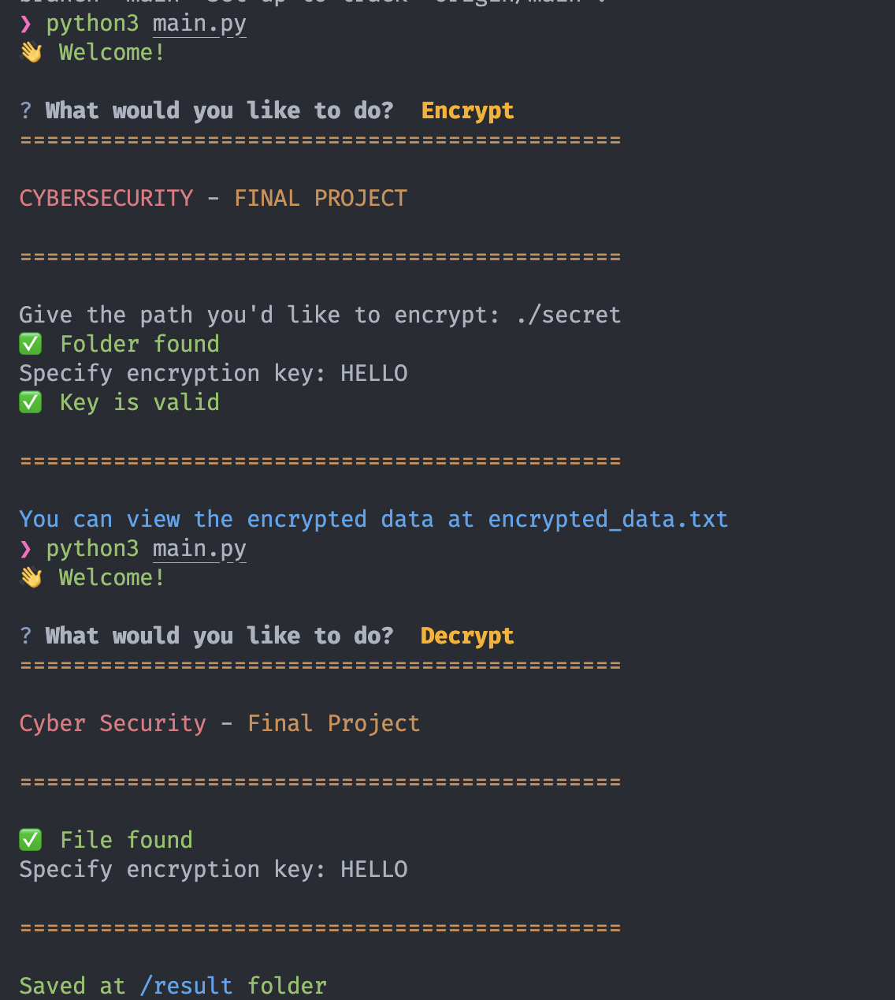

# Introduction
As part of my Cybersecurity studies I was asked to make a final project related to cybersecurity.

This project can encrypt whole directories (including their content) with a special key that the user provides. To restore the directory on another computer you'll need to have the key and run `python3 main.py load` to load the encrypted directories (it will ask for the key)

### HOW TO USE (STEP-BY-STEP)

1. Save the project on your computer: `git clone https://github.com/Lev-Shapiro/cyberSecuritySchoolProject.git levShapiroCyberSecurity`
2. Install all the required packages: `pip install -r requirements.txt`
3. Run `python3 main.py` and select one of the options (encrypt, load or hack). A more detailed explanation of this commands is provided in COMMANDS section
4. Specify all the required inputs
5. Results

### EXAMPLE:
1. Starting from step 3 of HOW TO USE SECTION (assuming you already saved the project on your computer and installed dependencies)
2. Run `python3 main.py`
3. Select `encrypt`
4. Specify example secret folder (already exists, no need to create one): `./secret`
5. Specify the key (digits, letter, anything I guess), example: `123HereIsYourKey!!!`
6. Folder is successfully encrypted. The encryption can be seen at `encrypted_data.txt`
7. To decrypt: `python3 main.py`
8. choose `decrypt`
9. specify the key written previously
10. Saved to folder `result`

### COMMANDS
`python3 main.py encrypt` - will encrypt the directory that you'll specify with a key that you'll provide

`python3 main.py load` - will load the encrypted directories using the key and encrypted_data.txt (which is generated by the previous command)

`python3 main.py hack` - will hack the existing encrypted_data.txt file (if it exists) and store the decrypted variant in hacked.txt (Folder tree including file contents). MAY BE NOT ACCURATE. Giving long encryption keys leads to non-accurate results for the hacking algorithm, while providing longer encryption content will have a better effect on the algorithm due to longer dataset (higher probability of getting the correct key).

`python3 main.py` - opens an radio button to select whether you want to encrypt or load the directory.

## USED PACKAGES

#### Install Everything Together
`pip install -r requirements.txt`

#### Install Every Library Separately
Typer: `pip install "typer[all]"`

PyInquirer: `pip install questionary`

Rich: `pip install rich`